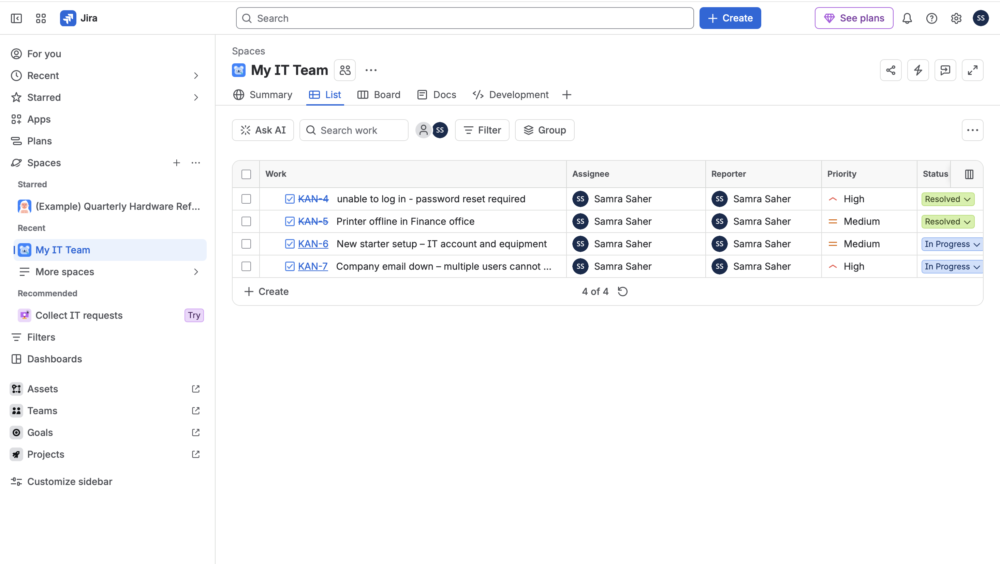
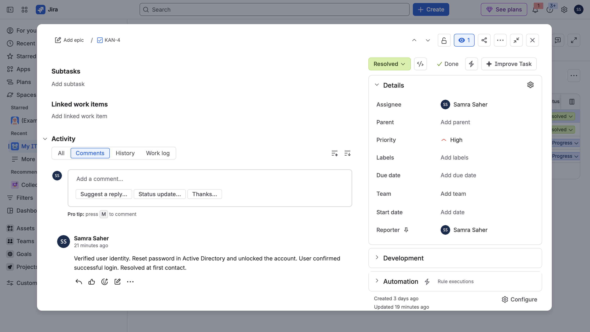

# IT Service Desk Ticketing Lab (Jira)

I built this lab to get hands-on with the ticketing side of first-line IT support — the part where you log a user's problem, work it, and either resolve it or pass it on. Job adverts for service-desk roles nearly always ask for a ticketing tool like Jira, ServiceNow or Freshservice, so I set up a service desk in Jira and ran realistic first-line tickets through it end to end.

Everything here is something I actually did, so I can talk through it properly in an interview.

## Setup

| | |
|---|---|
| Tool | Jira (Atlassian Cloud, free plan) |
| Project | "My IT Team" — used as a service-desk queue |
| My role | First-line analyst (I log the tickets and work them) |

## How I used it

I treated the project as a live ticket queue. For every ticket I set a **summary** (the problem in one line), a **description** (the detail), a **priority** based on impact and urgency, an **assignee** (me) and a **reporter** (the user), then moved it through the workflow and added a **comment** as my work/resolution note.

The point of first-line is **first-contact resolution** — fixing as much as possible myself and only escalating what's genuinely beyond first-line scope, with clear notes so the next team isn't starting from zero.

## The tickets I worked

| Ticket | Priority | What I did | Outcome |
|---|---|---|---|
| Unable to log in – password reset required | High | Verified identity, reset the password in Active Directory and unlocked the account | Resolved at first contact |
| Printer offline in Finance office | Medium | Checked connectivity, reconnected the printer and cleared the print queue | Resolved at first contact |
| New starter setup – IT account and equipment | Medium | Created the AD account, assigned a Microsoft 365 licence and groups, prepared the laptop | In progress (waiting for start date) |
| Company email down – multiple users affected | High | Confirmed it affected multiple users (not a local fault), documented impact and escalated to 2nd line | Escalated beyond first-line scope |

## What this covers

- Logging incidents accurately (summary, description, category)
- Prioritising by impact and urgency
- Working tickets through a status workflow (Open → In Progress → Resolved)
- First-contact resolution on common first-line issues (password resets, hardware, new starters)
- Knowing the boundary — escalating to 2nd line with clear handover notes
- Using a ticketing tool (Jira) day to day

## What I'd do next

- Set up SLAs so tickets have response and resolution targets
- Build a small knowledge base of fixes for recurring issues
- Add request types and a self-service portal so users can raise tickets themselves
